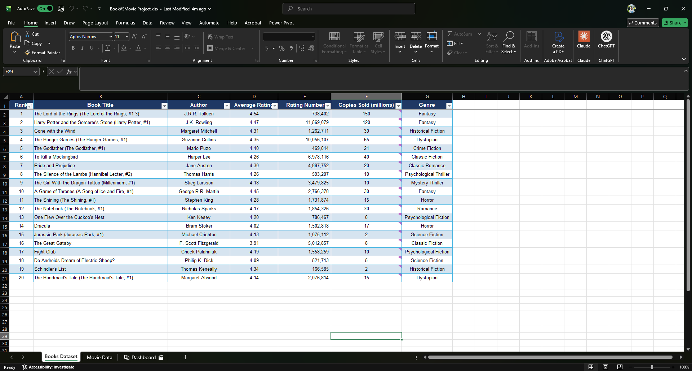
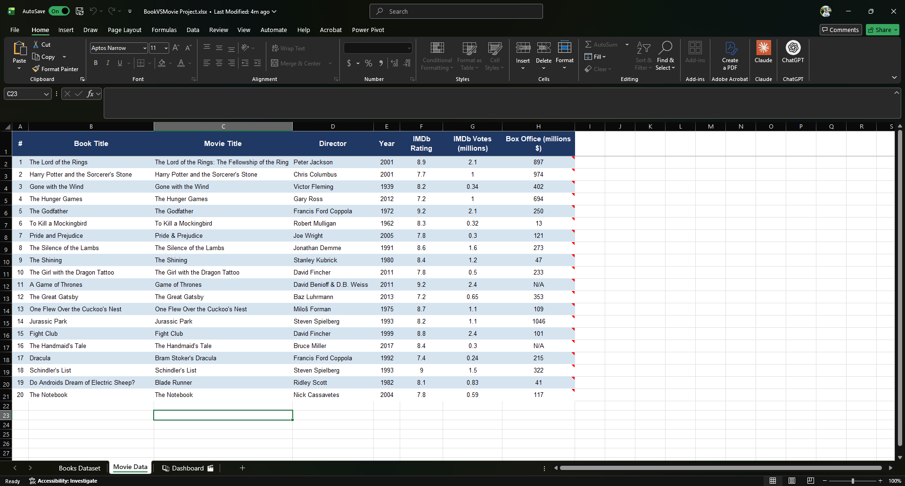
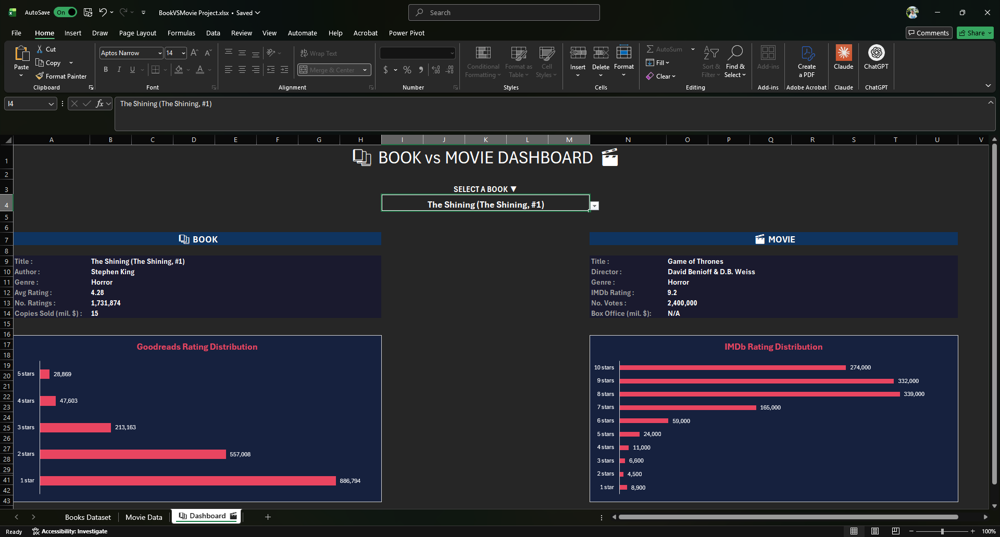

# Book or Movie?

An interactive Excel project comparing 20 famous books with their movie adaptations across ratings, audience size, and commercial success — built around one simple question: *which one is worth your time?*

## Where the idea came from

I read a lot, and most of the time when I pick up a book I already know it has a movie adaptation. Stephen King especially — almost everything he writes ends up on screen sooner or later. At some point I caught myself asking the same question over and over: *if I only have a few hours, should I read the book or watch the movie?*

That question kept nagging me. So I decided to actually try to answer it with data.

The plan was simple: take a list of famous books that have been adapted into films, pull objective numbers for both sides — ratings, audience size, sales — and put them face to face in a clean dashboard. No personal opinions, no critic reviews. Just the numbers, side by side, and let the reader decide.

---

## The sheets

### 📚 Books Dataset

This sheet holds all the book data — title, author, Goodreads average rating, number of ratings, and approximate copies sold (in millions). The list of 20 books was picked from the Goodreads "Best Movie Adaptations" public list, with one rule: no two entries from the same series or author. So instead of having five Harry Potter books in the dataset, I kept only the highest-ranked one from each series. Cells with approximate sales figures have notes attached explaining the source.

### 🎬 Movie Data

The mirror sheet for films. Same 20 titles, but now with movie title, director, year of release, IMDb rating, IMDb votes, and worldwide box office (in millions $). The columns were chosen to be directly comparable to the book side — IMDb rating mirrors Goodreads rating, IMDb votes mirror Goodreads ratings count, box office mirrors copies sold. Each Box Office cell has a note linking to the Box Office Mojo and IMDb sources.

### ⚔️ Comparison Dashboard

This is the interactive part of the project. A dropdown in the middle of the sheet lets the user pick any of the 20 titles. Once selected, the dashboard fills in two columns side by side:

- **Left side (book):** cover image, author, year, genre, Goodreads rating bar chart, number of ratings, copies sold
- **Right side (movie):** poster, director, year, genre, IMDb rating bar chart, number of votes, box office

There is no "winner" banner, no verdict. The numbers are presented openly and the user decides for themselves which one is worth their time.

---

## Methodology notes

A few things worth being upfront about:

**Ratings are on different scales.** Goodreads goes up to 5, IMDb goes up to 10. Both are presented as-is — no normalization — because most people are already familiar with both scales.

**Copies sold vs box office are not perfectly comparable.** One is unit count, the other is dollars. The film industry generates more money per "consumer" than book publishing does, so a film will almost always look bigger in dollar terms. The dashboard presents both numbers without forcing a comparison — it's up to the reader to interpret them.

**Sales data is approximated for some titles.** Books in the public domain (Dracula, Pride and Prejudice) or those without published sales figures (Fight Club, Do Androids Dream of Electric Sheep?) use estimates from Wikipedia and other commonly cited sources.

**Some adaptations are TV series, not films.** A Game of Thrones and The Handmaid's Tale are best known as HBO/Hulu shows, so they have no box office figure. Both are marked as N/A.

## Data sources

- [Goodreads "Best Movie Adaptations" list](https://www.goodreads.com/list/show/17956.Best_Movie_Adaptations) — for the initial book selection and ratings data
- [IMDb](https://www.imdb.com/) — for movie ratings and vote counts
- [Box Office Mojo](https://www.boxofficemojo.com/) — for worldwide box office figures
- [Wikipedia](https://www.wikipedia.org/) — cross-referenced for book sales figures, directors, and release years

Goodreads data was originally pulled via Power Query `From Web`, then converted to static values so the workbook no longer depends on live connections. IMDb blocks Power Query scraping, so movie data was collected manually.

## Tools used

- Excel (Power Query, Pivot Tables, Pivot Charts, Conditional Formatting)
- Data Validation, dropdowns, INDEX/MATCH and XLOOKUP for the dynamic dashboard
- Git + GitHub for version control

## Credits & honesty

This is the second project in my journey toward becoming a data analyst. The first one (Military Power Analysis) taught me how to scrape, clean, and structure web data. This one was about taking the next step — building a real interactive dashboard with dynamic visuals. The Excel foundations came from **Luke Barousse's Excel for Data Analytics** course, which I'd recommend to anyone starting out.

I also used **Claude** (Anthropic's AI) throughout the project — for things like deciding on the methodology (one book per series, how to handle approximate sales data, how to compare different rating scales), debugging Power Query issues, and figuring out how to build the dynamic dashboard with dropdowns and dependent visuals. The ideas, the structure, and the build are mine; Claude was the person I could bounce questions off when I got stuck.

## Author

**Alex Parnica**  
GitHub: [@Parnicoza](https://github.com/Parnicoza)
